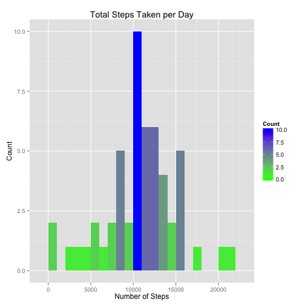
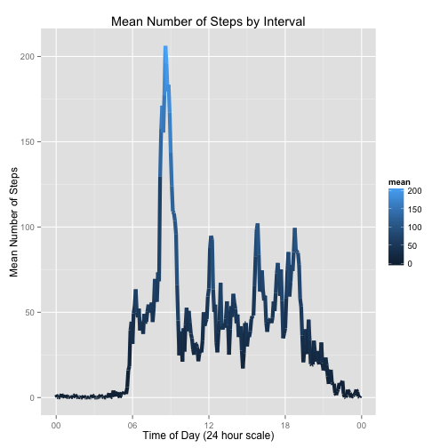
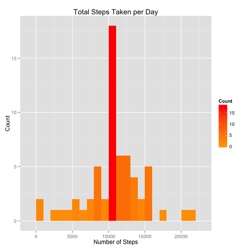
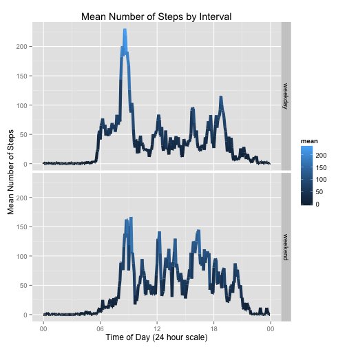

## Reproducable Research - Peer Assessment 1

### Loading and preprocessing the data 

Install required packages


```r
require(plyr)
require(dplyr)
require(Hmisc)
require(ggplot2)
require(lubridate)
require(scales)
require(stringr)
```

Set Options

```r
options(scipen=999) #Disable scientific notation
```

Check for data source file, download and unzip if missing

```r
if(!file.exists("activity.zip")) {
    url <- "https://d396qusza40orc.cloudfront.net/repdata%2Fdata%2Factivity.zip"
    download.file(url, destfile = "repdata-data-activity.zip", method="curl")
    unzip("repdata-data-activity.zip")
}
```

Load the data from the .csv file

```r
activity <- read.csv("activity.csv")
```

### What is mean total number of steps taken per day?

```r
q1_df <- activity[complete.cases(activity),] # remove rows with NAs
q1_df <- group_by(q1_df, date) # group by date
q1_daysums <- summarise(q1_df, sum=sum(q1_df$steps)) # Calculate Totals
```

**Calculate the mean and median total number of steps per day.**

```r
q1_mean <- mean(q1_daysums$sum) #Calc mean
q1_median <- median(q1_daysums$sum) # Calc median
```

**1. Plot histogram of total number of steps per day.** 

```r
h <- ggplot(q1_daysums, aes(sum)) 
h + geom_histogram(binwidth = 1000, aes(fill = ..count..)) +
  scale_fill_gradient("Count", low = "green", high = "blue") +
  xlab("Number of Steps") +
  ylab("Count") +
  ggtitle("Total Steps Taken per Day")
```

 

**2. Report the mean and median.**  
 - The mean total number of steps is 10766.1886792.  
 - The median total number of steps is 10765.

### What is the average daily activity pattern?


```r
q2_df <- activity[complete.cases(activity),] # remove rows with NAs
q2_df <- group_by(q2_df, interval) # group by interval code
interval_means <- summarise(q2_df, mean=mean(q2_df$steps)) # Calculate Means
```

To make the line plots display correctly, transform the interval codes into  
date and time fields. This ensures the points are evenly spaced along the x axis

```r
interval_means <- mutate(interval_means, hours = floor(interval/100), # Hours, Minutes
                      minutes = str_sub(interval, start = -2L, end = -1L))
interval_means <- mutate(interval_means, time = paste(hours, minutes, sep=":")) 
interval_means$time <- parse_date_time(interval_means$time, "%H:%M") # Create Date Time
interval_means <- select(interval_means, interval, mean, time)  # Clean up columns
```

**Identify the interval with the maximum mean number of steps.**

```r
max_interval <- interval_means$interval[which.max(interval_means$mean)]
max_mean <- max(interval_means$mean)
```

The mean number of steps per 5 minute interval is higher during normal waking hours. Peak activity is in the morning with smaller peaks that correspond with lunch time, end of the typical work day and late evening. 

**1. Make a time series plot with mean number of steps for each interval**

```r
t <- ggplot(interval_means, aes(x = time, y = mean))
t + geom_line(aes(colour=mean), lwd=2) + 
    xlab("Time of Day (24 hour scale)") + 
    ylab("Mean Number of Steps") +
    ggtitle("Mean Number of Steps by Interval") +
    scale_x_datetime(labels=date_format("%H"))
```

 

**2. Which 5-minute interval, on average across all the days in the dataset,**  
**contains the maximum number of steps?**  
 - The interval with the maximum mean number of steps is 835  
 - The subject took a mean of 206.1698113 steps between 835am and 840am. 

### Imputing missing values

**1. Calculate and report the total number of missing values in the dataset**

```r
missing <- length(activity$steps[is.na(activity$steps)])
```
 - There are 2304 rows with missing values (NAs). 

**2. Devise a strategy for filling in all of the missing values in the dataset.**  

Let's replace missing values (NAs) with the mean for that interval

**3. Create new dataset equal to the original dataset but with the missing data filled in.**


```r
q3_df <- activity
# Impute missing values from mean for that interval
q3_df <- ddply(q3_df, "interval", mutate, impute = impute(steps, mean))
# Replace missing values with corresponding mean
for (n in 1:length(q3_df$steps)) {
    if(is.na(q3_df$steps[n])) {
         q3_df$steps[n] <- q3_df$impute[n]
  }
}
q3_df <- select(q3_df, 1:3) # Create tidy dataset with missing values
q3_df$date <- parse_date_time(q3_df$date, "ymd") # Transform to date time
attach(q3_df)
activity_no_missing <- q3_df[order(date),] # Sort data frame
detach(q3_df)
```
**Quick Check to see that datasets are identical, except for imputed missing data**  

First 10 rows of original and new data sets

```r
head(activity)
```

```
##   steps       date interval
## 1    NA 2012-10-01        0
## 2    NA 2012-10-01        5
## 3    NA 2012-10-01       10
## 4    NA 2012-10-01       15
## 5    NA 2012-10-01       20
## 6    NA 2012-10-01       25
```

```r
head(activity_no_missing)
```

```
##         steps       date interval
## 1   1.7169811 2012-10-01        0
## 62  0.3396226 2012-10-01        5
## 123 0.1320755 2012-10-01       10
## 184 0.1509434 2012-10-01       15
## 245 0.0754717 2012-10-01       20
## 306 2.0943396 2012-10-01       25
```

Last 10 rows of orginal and new data sets

```r
tail(activity)
```

```
##       steps       date interval
## 17563    NA 2012-11-30     2330
## 17564    NA 2012-11-30     2335
## 17565    NA 2012-11-30     2340
## 17566    NA 2012-11-30     2345
## 17567    NA 2012-11-30     2350
## 17568    NA 2012-11-30     2355
```

```r
tail(activity_no_missing)
```

```
##           steps       date interval
## 17263 2.6037736 2012-11-30     2330
## 17324 4.6981132 2012-11-30     2335
## 17385 3.3018868 2012-11-30     2340
## 17446 0.6415094 2012-11-30     2345
## 17507 0.2264151 2012-11-30     2350
## 17568 1.0754717 2012-11-30     2355
```

Calculate daily totals

```r
q3_df <- activity_no_missing
q3_df <- group_by(q3_df, date) # group by date
q3_daysums <- summarise(q3_df, sum=sum(q3_df$steps)) # Calculate New Totals
```

**Calculate the mean and median total number of steps per day.**

```r
q3_mean <- mean(q3_daysums$sum) #Calc mean
q3_median <- median(q3_daysums$sum) # Calc median
```

**4.1 Plot histogram of total number of steps per day.**

```r
h <- ggplot(q3_daysums, aes(sum)) 
h + geom_histogram(binwidth = 1000, aes(fill = ..count..)) +
  scale_fill_gradient("Count", low = "orange", high = "red") +
  xlab("Number of Steps") +
  ylab("Count") +
  ggtitle("Total Steps Taken per Day")
```

 

**4.2 Report the mean and median.**  
 - The new mean total number of steps is 10766.1886792.  
 - The new median total number of steps is 10766.1886792.
 
 **4.3 Do these values differ from the estimates from the first part of the assignment?**  
 The two means are identical. The median when including the missing values is now equal to the mean, and slightly higher than the median without NAs. 
 
 **4.4 What is the impact of imputing missing data on  estimates of the total number of steps?**  
 Choosing to fill the missing values with the means for each interval results in 7 more days with totals near the mean total of steps. The histogram shows the count for step totals between 10,000 and 11,000 increasing by 7. All other bin counts remain the same.

### Are there differences in activity patterns between weekdays and weekends?

**reate a new factor variable in the dataset with two levels – “weekday” and “weekend”**

```r
q4_df <- q3_df # Create duplicate data frame
q4_df <- mutate(q4_df, weekday = weekdays(date), #create new variable
         day = ifelse(weekday %in% c("Saturday", "Sunday"), "weekend", "weekday"))
q4_df$day <- as.factor(q4_df$day) #transform to factor variable
q4_df <- select(q4_df, steps:interval, day) # clean up columns
q4_df <- group_by(q4_df, interval, day) # group by interval code
new_means <- summarise(q4_df, mean=mean(q4_df$steps)) # Calculate New Means
new_means <- mutate(new_means, hours = floor(interval/100), # Calc Hours, Minutes
                       minutes = str_sub(interval, start = -2L, end = -1L))
new_means <- mutate(new_means, time = paste(hours, minutes, sep=":")) 
new_means$time <- parse_date_time(new_means$time, "%H:%M") # Create Date Time column
new_means <- select(new_means, interval:mean, time)  # Clean up columns
```

**Make a panel plot containing a time series plot (i.e. type = "l") of the 5-minute interval (x-axis) and the average number of steps taken**

Create panel plot using ggplot2 and facet grid

```r
p <- ggplot(new_means, aes(x = time, y = mean,))
p + geom_line(aes(colour=mean), lwd=2) + 
    facet_grid(day ~.) +
    xlab("Time of Day (24 hour scale)") + 
    ylab("Mean Number of Steps") +
    ggtitle("Mean Number of Steps by Interval") +
    scale_x_datetime(labels=date_format("%H"))
```

 

Activity across weekdays and weekends are similar, with peaks occurring in the morning between 8am and 9am. Weekend days show higher step totals for intervals during working hours, and less pronounced peaks in step counts. 

